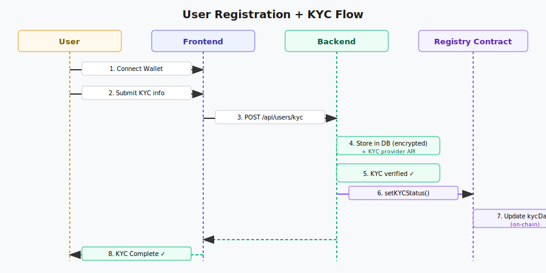
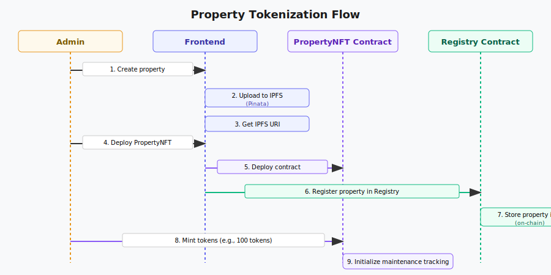
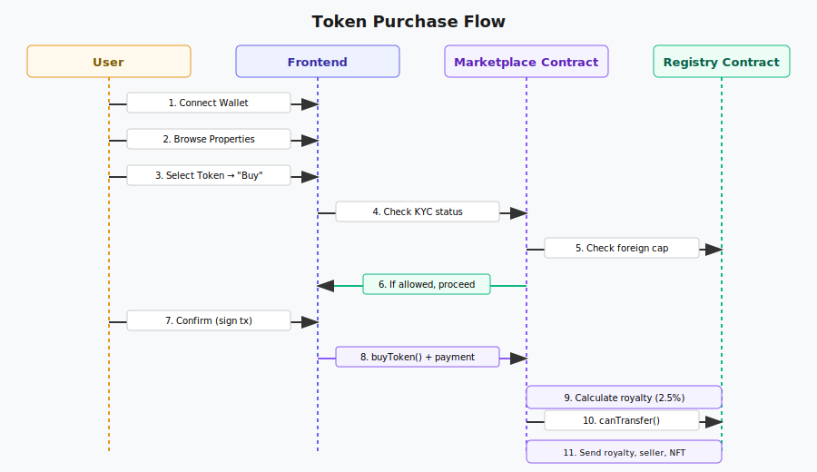
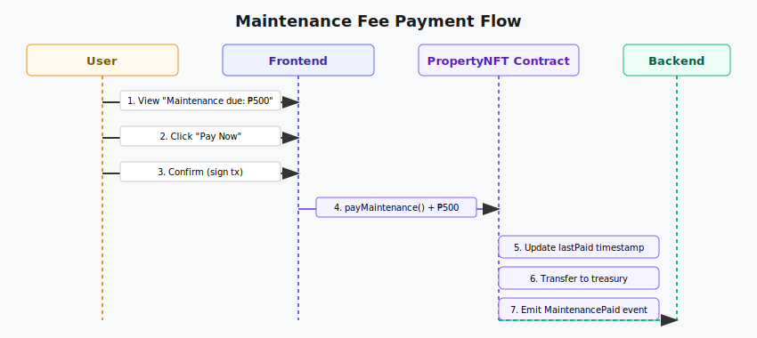

# Data Flow Diagrams

## 1. User Registration + KYC Flow

## 2. Property Tokenization Flow

## 3. Token Listing Flow

The token listing flow involves a seller approving the marketplace contract, listing their token with a price, and the NFT being transferred to marketplace escrow. See the token purchase flow for the complete buy/sell cycle.

## 4. Token Purchase Flow

## 5. Maintenance Payment Flow

## 6. Governance: Proposal Creation + Voting Flow

The governance flow involves admins creating proposals, token holders casting votes weighted by their token holdings, and the backend tracking vote tallies. Phase 2 will move voting fully on-chain.

## 7. Token Redemption Flow (Future)

Token redemption allows Filipino token holders to redeem their tokens for physical property deeds. This requires additional legal infrastructure and is planned for Phase 3.

## Event Indexing

All major state changes emit events that are indexed by the backend:

- `PropertyRegistered` → Update properties table
- `TokenListed` → Insert into listings table
- `TokenSold` → Update listings, transfer ownership
- `MaintenancePaid` → Insert into maintenance_payments
- `KYCStatusUpdated` → Update users table
- `ProposalCreated` (Phase 2) → Insert into proposals
- `VoteCast` (Phase 2) → Insert into votes

Backend indexer listens to blockchain events and updates PostgreSQL accordingly.
