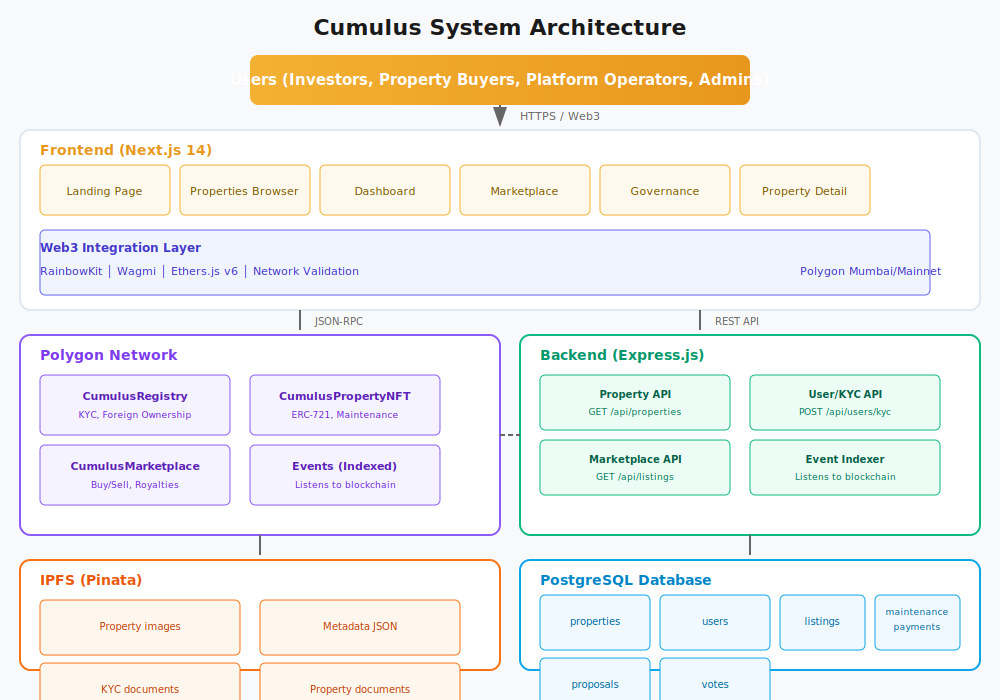
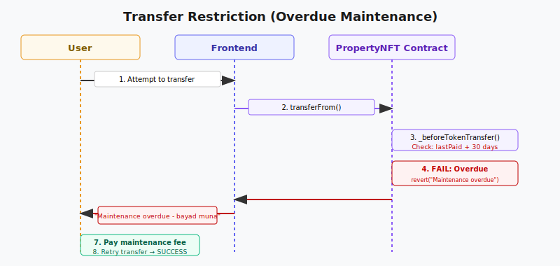
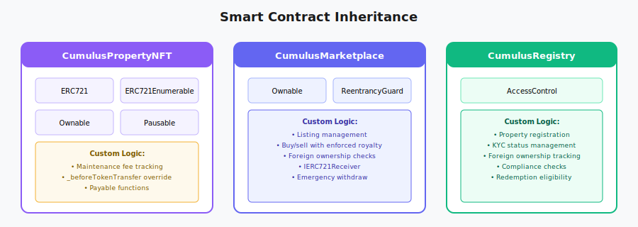

# Cumulus System Overview

## High-Level Architecture

## Component Interactions

### Token Purchase Flow

### Maintenance Fee Payment Flow

### Transfer Restriction (Overdue Maintenance)

## Smart Contract Architecture

### Inheritance Tree

## Security Model

### Smart Contract Security
- OpenZeppelin battle-tested contracts
- Multi-signature for admin functions (Gnosis Safe in production)
- Pausable contracts for emergency situations
- Reentrancy protection (Checks-Effects-Interactions)
- Access control on all admin functions
- Input validation on all public functions
- Events for all state changes (audit trail)

### Backend Security
- API rate limiting
- API key authentication for admin endpoints
- Input validation (Zod/Joi)
- SQL injection prevention (parameterized queries)
- CORS configuration
- Helmet.js security headers
- HTTPS enforcement

### Data Security
- KYC data encrypted at rest (AES-256)
- Database access restricted by role
- No PII stored on-chain
- Private keys never stored in code
- Environment variables for secrets

## Scalability Considerations

### Read Scaling
- Off-chain indexing (custom indexer or The Graph)
- Database read replicas for high traffic
- CDN for static assets (Vercel Edge Network)
- IPFS gateway caching (Pinata)
- WebSocket for real-time updates (not polling)

### Write Scaling
- Batch operations (Phase 2)
- Meta-transactions for gasless UX (Phase 2)
- Layer 2 consideration (Polygon already L2-ish)

### Future Scaling Options
- Polygon zkEVM migration (lower fees)
- Arbitrum/Optimism migration
- Chainlink Automation for maintenance fees
- The Graph for indexing

## Monitoring & Observability

### Smart Contracts
- Event logging for all state changes
- Polygonscan verification
- Tenderly monitoring (production)
- Alert system for unusual activity

### Backend
- Winston/Pino logging
- Error tracking (Sentry)
- Uptime monitoring
- Performance metrics (APM)

### Frontend
- Error boundaries
- Sentry error tracking
- Analytics (PostHog or Plausible)
- Performance monitoring (Web Vitals)
